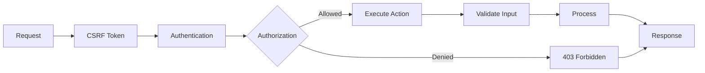

# 📋 Sistem Absensi PKL (Praktik Kerja Lapangan)

> Sistem manajemen absensi terintegrasi untuk Program Kerja Lapangan dengan fitur foto bukti, lokasi GPS akurat, dan monitoring pembina.

## 🏗️ Architecture Diagrams

### 📊 Entity Relationship Diagram (ERD)


### 🎯 UML Class Diagram


```mermaid
flowchart LR
    classDef actor fill:#eef2ff,stroke:#6366f1,color:#312e81,stroke-width:2px;
    classDef usecase fill:#fff7ed,stroke:#fb923c,color:#9a3412,stroke-width:1.5px;
    
    ADM((Admin)):::actor
    PMB((Pembina)):::actor
    PST((Peserta)):::actor
    
    subgraph UC[Use Cases]
        direction TB
        ucAuthLogin[(Login/Autentikasi)]:::usecase
        ucAuthLogout[(Logout)]:::usecase
        
        ucPembinaManage[(Kelola data pembina)]:::usecase
        ucPembinaList[(Lihat daftar pembina)]:::usecase
        ucPembinaCreate[(Tambah pembina baru)]:::usecase
        ucPembinaEdit[(Edit data pembina)]:::usecase
        ucPembinaDelete[(Hapus pembina)]:::usecase
        ucPembinaDetail[(Lihat detail pembina)]:::usecase
        
        ucPesertaManage[(Kelola data peserta)]:::usecase
        ucPesertaList[(Lihat daftar peserta)]:::usecase
        ucPesertaCreate[(Tambah peserta baru)]:::usecase
        ucPesertaEdit[(Edit data peserta)]:::usecase
        ucPesertaDelete[(Hapus peserta)]:::usecase
        ucPesertaStatus[(Lihat status kehadiran peserta)]:::usecase
        
        ucAttendanceManage[(Kelola absensi)]:::usecase
        ucAttendanceList[(Lihat daftar absensi)]:::usecase
        ucAttendanceIn[(Catat absensi masuk)]:::usecase
        ucAttendanceOut[(Catat absensi keluar)]:::usecase
        ucAttendanceEdit[(Edit absensi)]:::usecase
        ucAttendanceDelete[(Hapus absensi)]:::usecase
        ucAttendanceDetail[(Lihat detail absensi)]:::usecase
        ucPhotoIn[(Upload foto masuk)]:::usecase
        ucPhotoOut[(Upload foto keluar)]:::usecase
        ucSignature[(Tanda tangan digital)]:::usecase
    end
    
    ADM --- ucAuthLogin
    ADM --- ucAuthLogout
    ADM --- ucPembinaManage
    ADM --- ucPembinaList
    ADM --- ucPembinaCreate
    ADM --- ucPembinaEdit
    ADM --- ucPembinaDelete
    ADM --- ucPembinaDetail
    ADM --- ucPesertaManage
    ADM --- ucPesertaList
    ADM --- ucPesertaCreate
    ADM --- ucPesertaEdit
    ADM --- ucPesertaDelete
    ADM --- ucAttendanceManage
    ADM --- ucAttendanceList
    ADM --- ucAttendanceEdit
    ADM --- ucAttendanceDelete
    ADM --- ucAttendanceDetail
    
    PMB --- ucAuthLogin
    PMB --- ucAuthLogout
    PMB --- ucPesertaList
    PMB --- ucPesertaStatus
    PMB --- ucAttendanceList
    PMB --- ucAttendanceDetail
    
    PST --- ucAuthLogin
    PST --- ucAuthLogout
    PST --- ucAttendanceIn
    PST --- ucAttendanceOut
    PST --- ucAttendanceList
    PST --- ucAttendanceDetail
    PST --- ucPhotoIn
    PST --- ucPhotoOut
    PST --- ucSignature
```

### 🔄 ERD

```mermaid
graph TD
    A[User Access] --> B{Check Role}
    B -->|Admin| C[Admin Dashboard]
    B -->|Pembina| D[Pembina Dashboard]
    B -->|Peserta| E[Peserta Dashboard]
    
    C --> C1[Manage Pembina]
    C1 --> C1a[Create Pembina]
    C1 --> C1b[Edit Pembina]
    C1 --> C1c[Delete Pembina]
    C1 --> C1d[View Pembina List]
    C1 --> C1e[View Pembina Detail]
    
    C --> C2[Manage Peserta]
    C2 --> C2a[Create Peserta]
    C2 --> C2b[Edit Peserta]
    C2 --> C2c[Delete Peserta]
    C2 --> C2d[Assign Peserta to Pembina]
    C2 --> C2e[View Peserta List]
    C2 --> C2f[View Peserta Status]
    
    C --> C3[Manage Attendance]
    C3 --> C3a[View Attendance List]
    C3 --> C3b[Edit Attendance]
    C3 --> C3c[Delete Attendance]
    C3 --> C3d[View Attendance Detail]
    C3 --> C3e[Set Attendance Status]
    C3 --> C3f[Generate Report]
    
    D --> D1[Monitor Peserta]
    D1 --> D1a[View Peserta Binaan]
    D1 --> D1b[View Peserta Status]
    
    D --> D2[View Attendance]
    D2 --> D2a[View Attendance List]
    D2 --> D2b[View Attendance Detail]
    D2 --> D2c[Generate Report]
    
    E --> E1[Create Attendance]
    E1 --> E1a[Check In]
    E1 --> E1b[Check Out]
    
    E1a --> E2[Upload Foto Masuk]
    E1a --> E3[Digital Signature]
    E1a --> E4[Input Keterangan]
    
    E1b --> E5[Upload Foto Keluar]
    E1b --> E6[Digital Signature]
    
    E --> E7[View My Attendance]
    E7 --> E7a[View Attendance List]
    E7 --> E7b[View Attendance Detail]
    
    style A fill:#e1f5ff
    style B fill:#fff9c4
    style C fill:#c8e6c9
    style D fill:#b3e5fc
    style E fill:#ffccbc
    
  
```



### 🛡️ Security Architecture



## 🌟 Fitur Utama

- 📸 **Upload Foto Bukti** - Peserta dapat upload foto saat masuk dan keluar
- 📍 **GPS Location Tracking** - Pencatatan koordinat lokasi otomatis untuk verifikasi
- 👁️ **Monitoring Pembina** - Pembina dapat memantau kehadiran semua peserta binaan
- 📊 **Dashboard Analytics** - Dashboard untuk 3 role berbeda (Admin, Pembina, Peserta)
- ✅ **CRUD Lengkap** - Manajemen data pembina, peserta, dan absensi
- 🔐 **Role-Based Access** - Sistem security dengan 3 role berbeda
- 🎨 **UI/UX Responsive** - Interface yang user-friendly dan mobile-friendly
- ✍️ **Digital Signature** - Tanda tangan digital untuk verifikasi identitas peserta

## 📚 Dokumentasi

Dokumentasi lengkap tersedia dalam beberapa file:

| File | Deskripsi | Waktu Baca |
|------|-----------|-----------|
| **[INDEX.md](INDEX.md)** | 🎯 Start here - Index & navigasi | 5 min |
| **[QUICK_START.md](QUICK_START.md)** | 🚀 Setup dalam 5 menit | 10 min |
| **[DOKUMENTASI.md](DOKUMENTASI.md)** | 📖 Panduan lengkap & komprehensif | 30 min |
| **[ERD.md](ERD.md)** | 🗄️ Entity Relationship Diagram | 20 min |
| **[CRUD_GUIDE.md](CRUD_GUIDE.md)** | 🔄 Detail semua CRUD operation | 35 min |
| **[CHANGELOG.md](CHANGELOG.md)** | 📝 Version history & roadmap | 10 min |

## 🚀 Quick Start

### 1️⃣ Setup Database
```bash
# Buat database MySQL
CREATE DATABASE absensi_pkl;
EXIT;
```

### 2️⃣ Configure Environment
Edit file `.env`:

``` Ubah File Environment
cp .env.example .env
 ```

```env    
DB_CONNECTION=mysql
DB_HOST=127.0.0.1
DB_PORT=3306
DB_DATABASE=absensi_pkl
DB_USERNAME=root
DB_PASSWORD=
```

### 3️⃣ Install & Run
```bash
# Install dependencies
composer install
npm install

# Generate key
php artisan key:generate

# Migrate database
php artisan migrate

# Link storage
php artisan storage:link

# Jalankan Seeder
php artisan db:seed --class=DatabaseSeeder


# Build assets
npm run build

# Run server
php artisan serve
```

**Aplikasi ready di**: http://localhost:8000

## Login Admin

### Gmail

```
admin@absensi-pkl.local
```

### Password

```
Admin123456
```

## 👥 User Roles

### 👤 PESERTA
- Input absensi dengan foto & GPS
- Lihat riwayat absensi pribadi
- Dashboard statistik kehadiran

### 👨‍💼 PEMBINA
- Monitor peserta binaan
- Verifikasi absensi
- Dashboard monitoring

### 🔑 ADMIN
- Kelola data pembina (CRUD)
- Kelola data peserta (CRUD)
- Lihat statistik keseluruhan

## 🗄️ Database Schema

Sistem menggunakan 4 tabel utama:

```
USERS → PEMBINAS → PESERTAS → ATTENDANCES
(1:1)   (1:N)     (1:N)      (with photos & GPS)
```

Lihat **[ERD.md](ERD.md)** untuk diagram lengkap.

## 📁 Project Structure

```
absensi-pkl/
├── app/Http/Controllers/      ← 5 controllers
├── app/Models/                ← 4 models
├── database/migrations/       ← 4 migrations
├── resources/views/           ← 18 blade views
├── routes/web.php            ← 25+ routes
├── storage/app/public/       ← Upload files
└── 📚 Dokumentasi files...
```

## 🔧 Tech Stack

- **Backend**: Laravel 12.0 + PHP 8.2
- **Database**: MySQL 8.0
- **Frontend**: Bootstrap 5.3 + Font Awesome 6.4
- **Build Tool**: Vite
- **Storage**: Local storage (photos)

## ✨ Fitur CRUD

### Pembina Management (Admin)
- ✅ Create pembina baru
- ✅ Read daftar pembina
- ✅ Update data pembina
- ✅ Delete pembina (cascade)

### Peserta Management (Admin)
- ✅ Create peserta baru
- ✅ Read daftar peserta
- ✅ Update data peserta
- ✅ Delete peserta (cascade)

### Attendance Management (All Roles)
- ✅ Create absensi + foto + GPS
- ✅ Read dengan role-based filter
- ✅ Update absensi & foto
- ✅ Delete dengan akses control

## 🔐 Security Features

- ✅ Password hashing (bcrypt)
- ✅ CSRF protection
- ✅ Input validation
- ✅ File upload validation
- ✅ Role-based authorization
- ✅ Cascade delete constraints
- ✅ Session management

## 📋 Routes Reference

```
# Public
GET  /                    → Homepage
GET  /login              → Login form
GET  /register           → Register form

# Auth Required
GET  /dashboard          → Dashboard (role-based)
GET  /logout             → Logout

# Pembina Management (Admin)
GET    /pembina          → Daftar pembina
POST   /pembina          → Create pembina
GET    /pembina/{id}     → Detail pembina
PUT    /pembina/{id}     → Update pembina
DELETE /pembina/{id}     → Delete pembina

# Peserta Management (Admin)
GET    /peserta          → Daftar peserta
POST   /peserta          → Create peserta
GET    /peserta/{id}     → Detail peserta
PUT    /peserta/{id}     → Update peserta
DELETE /peserta/{id}     → Delete peserta

# Attendance (All Auth Users)
GET    /attendance       → Daftar absensi
POST   /attendance       → Create absensi
GET    /attendance/{id}  → Detail absensi
PUT    /attendance/{id}  → Update absensi
DELETE /attendance/{id}  → Delete absensi
```


## 📖 How to Use

1. **Baca INDEX.md** untuk navigasi dokumentasi
2. **Ikuti QUICK_START.md** untuk setup
3. **Baca DOKUMENTASI.md** untuk pemahaman mendalam
4. **Referensi ERD.md** untuk struktur database
5. **Check CRUD_GUIDE.md** untuk detail operasi

## 🐛 Troubleshooting

### Database connection error?
```bash
# Check .env configuration
# Ensure database exists
php artisan migrate
```

### File not found?
```bash
php artisan storage:link
chmod -R 755 storage/
```

### Port 8000 already used?
```bash
php artisan serve --port=8001
```

Lihat **QUICK_START.md** untuk troubleshooting lebih lanjut.

## 📊 Statistics

- **5** Controllers
- **4** Models
- **18** Blade Views
- **4** Database Tables
- **25+** Routes
- **50+** Total Files

## 🚀 Fitur Bonus (Dapat Dikembangkan)

- 📊 Export ke PDF/Excel
- 📧 Email notifications
- 🔌 REST API
- 🎫 QR Code attendance
- 📱 Mobile app
- ⚡ Real-time monitoring
- 🤖 Face recognition

## 📝 Documentation Files

Semua dokumentasi tersedia dalam format Markdown:

- **INDEX.md** - Index & navigation guide
- **QUICK_START.md** - 5-minute setup
- **DOKUMENTASI.md** - Comprehensive guide
- **ERD.md** - Database schema
- **CRUD_GUIDE.md** - CRUD details
- **CHANGELOG.md** - Version history
- **README.md** - This file

## 📞 Support

**Untuk bantuan:**
1. Check troubleshooting di QUICK_START.md
2. Review documentations
3. Check Laravel logs: `storage/logs/laravel.log`
4. Clear cache: `php artisan cache:clear`

## 📄 License

MIT License - Free to use and modify

## 🎉 Getting Started

→ **Mulai dari sini: [INDEX.md](INDEX.md)**

---

**Dibuat dengan ❤️ menggunakan Laravel 12 & Bootstrap 5**

*Last Updated: 27 November 2025*
*Version: 1.0.0*
